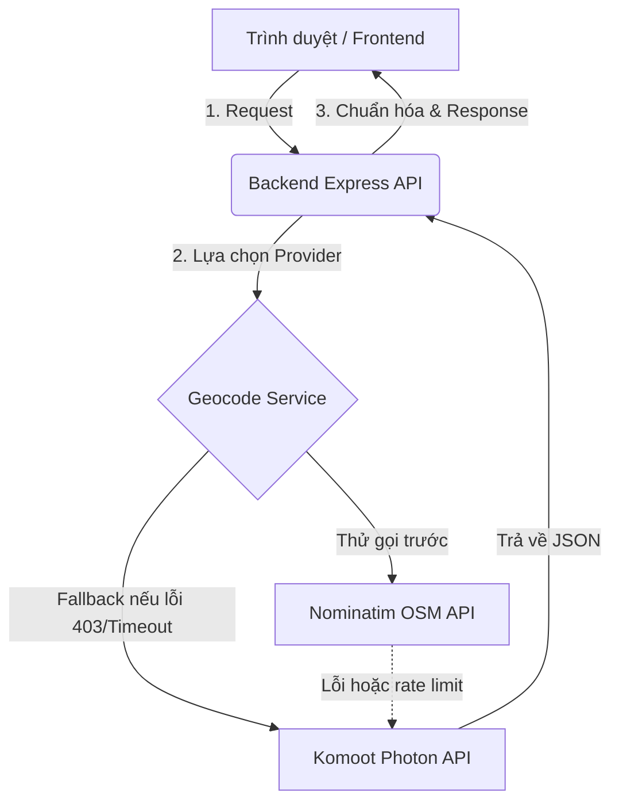
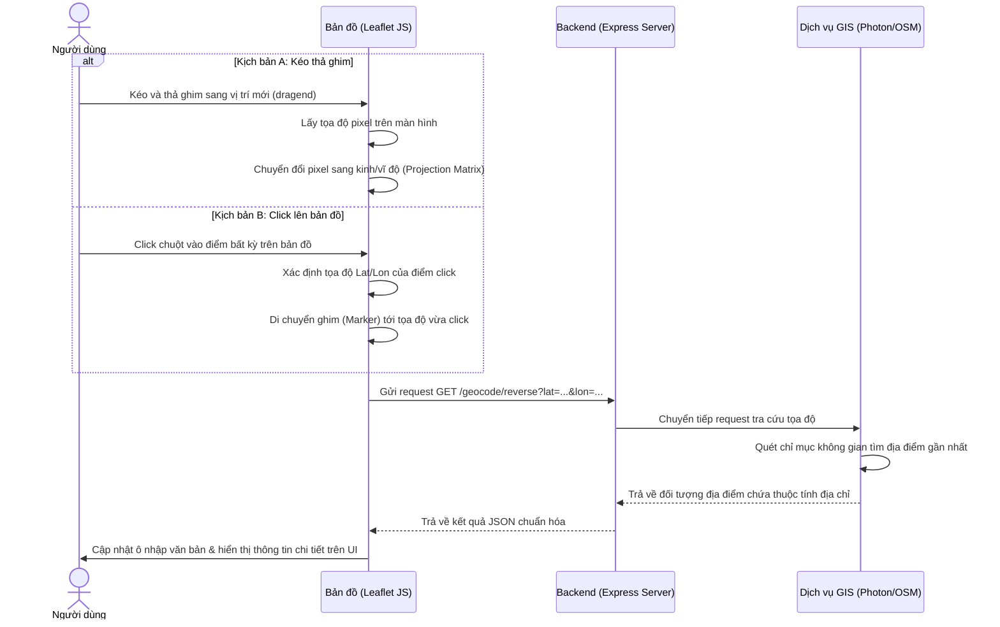

# Hướng dẫn Vận hành API & Logic Kéo thả Định vị (Interactive Geocoding Guide)

Tài liệu này giải thích chi tiết cấu trúc hệ thống, cơ chế hoạt động của các API định vị toàn cầu (`global-location-api`), và nguyên lý kỹ thuật đằng sau tính năng tương tác kéo thả ghim / click chọn địa điểm trên bản đồ.

---

## 1. Kiến trúc tổng quan (Architecture Overview)

Hệ thống hoạt động theo mô hình client-server thời gian thực (Real-time client-server architecture). Backend không sử dụng cơ sở dữ liệu nội bộ để lưu trữ địa chỉ toàn cầu nhằm tối ưu tài nguyên, thay vào đó sử dụng các bộ máy chỉ mục không gian (Spatial Search Engine) công cộng của **OpenStreetMap (OSM)**:

---

## 2. Chi tiết hoạt động của các API (Backend APIs)

Hệ thống cung cấp 3 endpoint chính hỗ trợ đầy đủ cho mọi kịch bản tích hợp:

### 2.1. API Gợi ý địa chỉ tự động (Autocomplete Suggest)
*   **Endpoint**: `GET /api/v1/address/suggest?q={keyword}`
*   **Nguyên lý hoạt động**:
    1. Khi người dùng nhập ký tự (ví dụ: `"Shib"`), frontend gửi từ khóa lên backend.
    2. Backend gọi API tìm kiếm của **Photon** hoặc **Nominatim** với tham số giới hạn `limit=5`.
    3. Bộ máy tìm kiếm thực hiện tìm kiếm mờ (Fuzzy Search) trên bảng chỉ mục từ vựng địa lý toàn cầu.
    4. Trả về danh sách gồm nhãn địa chỉ đầy đủ (`label`), Tọa độ (`latitude`, `longitude`), Tên quốc gia (`country`), và Thành phố (`city`).

### 2.2. API Tìm tọa độ từ địa chỉ (Forward Geocoding)
*   **Endpoint**: `POST /api/v1/geocode` (Body: `{ "address": "..." }`)
*   **Nguyên lý hoạt động**:
    1. Chuyển đổi một chuỗi địa chỉ văn bản hoàn chỉnh thành tọa độ bản đồ.
    2. Hữu ích khi hệ thống cần đồng bộ dữ liệu địa chỉ cũ hoặc lưu tọa độ tự động từ file excel/hóa đơn mà không có giao diện tương tác.

### 2.3. API Tìm địa chỉ từ tọa độ (Reverse Geocoding)
*   **Endpoint**: `GET /api/v1/geocode/reverse?lat={latitude}&lon={longitude}`
*   **Nguyên lý hoạt động**:
    1. Khi nhận được tọa độ Lat/Lon, backend gửi yêu cầu tra cứu ngược tới máy chủ GIS.
    2. Máy chủ GIS sử dụng thuật toán **Tìm kiếm lân cận gần nhất (Nearest Neighbor Search)** dựa trên chỉ mục không gian (Spatial Indexing) để tìm thực thể địa lý (tòa nhà, số nhà, đường) gần tọa độ đó nhất trong bán kính cho phép.
    3. Trả về thông tin địa chỉ chi tiết của điểm đó.

---

## 3. Nguyên lý Logic Kéo thả Ghim & Click Bản đồ (Interactive Map Logic)

Quy trình đồng bộ giữa hành động kéo thả chuột của người dùng và địa chỉ văn bản trên ô nhập liệu hoạt động theo sơ đồ tuần tự dưới đây:

### 3.1. Chuyển đổi Tọa độ màn hình sang Tọa độ địa lý (Screen Pixels to Lat/Lon)
Bản đồ thực chất là một bức ảnh canvas được ghép từ các mảnh hình vuông (map tiles).
*   Khi bạn click chuột hoặc thả ghim, trình duyệt chỉ nhận diện được tọa độ pixel `(x, y)` của màn hình.
*   **Leaflet.js** sử dụng ma trận chiếu bản đồ **Web Mercator (EPSG:3857)** để tính toán ngược: chuyển đổi từ vị trí điểm pixel trên màn hình, kết hợp với mức độ phóng to của bản đồ (Zoom level) và tọa độ trung tâm hiện tại, để cho ra chính xác số **Kinh độ (Longitude)** và **Vĩ độ (Latitude)** thực tế của Trái Đất.

### 3.2. Thực thi Reverse Geocoding & Cập nhật UI
Khi có tọa độ địa lý mới:
1.  Frontend kích hoạt hàm `updateCoordinatesAndAddress(lat, lon)`.
2.  Yêu cầu API gửi đi và hiển thị hiệu ứng xoay tải (`loader`).
3.  Khi nhận response thành công từ backend, frontend sẽ:
    *   Cập nhật giá trị hiển thị của thanh tìm kiếm: `searchInput.value = res.data.formattedAddress`.
    *   Ghi các thông tin chi tiết vào bảng dữ liệu: Quốc gia, Thành phố, Múi giờ, Kinh độ, Vĩ độ để người dùng xác nhận.

---

## 4. Cơ chế chuyển đổi dự phòng chống quá tải (Resilient Fallback)

Do sử dụng các API OSM miễn phí, hệ thống rất dễ gặp tình trạng bị giới hạn hoặc chặn IP khi có lưu lượng truy cập lớn (lỗi `403 Forbidden` hoặc `429 Too Many Requests`). Hệ thống được bảo vệ bằng lớp dự phòng tự động:

1.  **Nominatim (Mặc định)**: Có độ chi tiết địa chỉ rất cao, định dạng rõ ràng, được ưu tiên gọi trước.
2.  **Photon (Dự phòng)**: Nếu Nominatim trả về bất kỳ mã lỗi nào (loại trừ lỗi không tìm thấy địa chỉ `404`), module quản lý lỗi (`geocode.service.js`) sẽ lập tức chuyển hướng request sang **Photon**.
3.  Quá trình này chỉ mất vài mili-giây và diễn ra hoàn toàn ẩn dưới backend, giúp giao diện người dùng không bị đơ hay báo lỗi đỏ.
